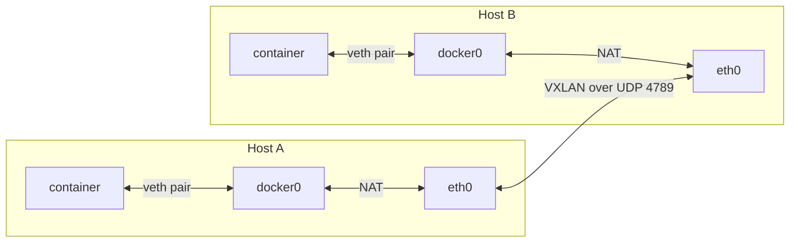

# Docker Networking Internals

---

## Core Primitive: Network Namespaces

Each container = isolated Linux **network namespace** (`netns`).

- Separate routing table, iptables rules, interfaces, ARP table.
- Zero visibility into host's or other containers' network stack unless explicitly connected.

---

## Architecture Overview



---

## Bridge Networks

**1. Docker creates a Linux bridge device** (virtual switch) per user-defined network.

```bash
ip link show | grep br-
# br-<network_id>
```

**2. Each container gets a veth pair** (virtual ethernet cable, two ends).

- One end inside the container's netns -> appears as `eth0`.
- Other end attached to the bridge on the host.

```bash
ip link show
# veth1234@if5 (host side, attached to br-xxxx)
```

**3. Bridge acts as an L2 switch.** All veth host-ends on the same bridge forward Ethernet frames to each other. Same-network containers reach each other by IP.

**4. IP assignment:** Docker's internal IPAM assigns each container an IP from the bridge's subnet (e.g. `172.18.0.0/16`) and sets the container's default route to the bridge gateway IP.

---

## Embedded DNS (127.0.0.11)

- Docker injects `/etc/resolv.conf` pointing to `127.0.0.11` inside the container netns.
- Not a real per-container listener. Docker daemon intercepts DNS queries via iptables redirect to its internal resolver process.
- Resolver holds a live map: **container name -> current IP**, updated on start/stop.
- **Default bridge does not wire this up.** No name registration on `docker0`. Always use user-defined networks.

---

## External Connectivity: NAT via iptables

Containers reach the internet through **SNAT/MASQUERADE** in the `POSTROUTING` chain.

```bash
iptables -t nat -L POSTROUTING
# MASQUERADE all -- 172.18.0.0/16 anywhere
```

- Requires `net.ipv4.ip_forward=1` on the host.
- Inbound (`docker run -p 8080:80`) creates a **DNAT** rule in `PREROUTING`/`DOCKER`, forwarding `host:8080 -> container:80`.

---

## Cross-Network Isolation

- Separate bridges = separate L2 broadcast domains. No frame crosses `br-net1 <-> br-net2` unless routed.
- Docker inserts explicit DROP rules in `DOCKER-ISOLATION-STAGE-1/2` chains.

```bash
iptables -L DOCKER-ISOLATION-STAGE-2
# DROP rules between bridge interfaces
```

- `docker network connect othernet container` does **not** bridge the two networks. It adds a second veth pair into the container's netns (`eth1`) with an IP on the second bridge. The container straddles both L2 domains individually. The networks themselves stay isolated.

---

## Multi-Host: Overlay Networks

Single-host bridges can't span machines. Overlay uses **VXLAN** encapsulation:

- Each container frame is wrapped in a UDP packet (VXLAN header + VNI id) and sent host-to-host.
- Each host runs a VXLAN Tunnel Endpoint (VTEP).
- A distributed key-value store or gossip protocol syncs the IP -> MAC -> host mapping.

---

## Kubernetes Mapping

| Docker concept                     | Kubernetes equivalent                                        |
| ---------------------------------- | ------------------------------------------------------------ |
| Container netns                    | Pod netns (same primitive)                                   |
| dockerd wiring veth/bridge         | CNI plugin (Calico, Cilium, etc.)                            |
| iptables NAT/isolation             | eBPF (Cilium) - same job, no linear chain traversal          |
| Embedded DNS resolver (127.0.0.11) | CoreDNS - same idea, cluster-scoped                          |
| `DOCKER-ISOLATION` chains          | NetworkPolicy - same enforcement point, label-selector based |

---

## Inspect Live

```bash
docker network create testnet
docker run -d --name c1 --network testnet alpine sleep 3600

brctl show                                                          # bridge + attached veths
nsenter -t $(docker inspect -f '{{.State.Pid}}' c1) -n ip addr     # inspect container netns directly
```

`ip netns list` won't show container netns because Docker doesn't register them under `/var/run/netns`. Use `nsenter` against the container's PID instead.

---

## Service Discovery

Containers need to find each other by name, not IP. IPs are ephemeral — every `docker run` gets a new one.

### Docker's embedded DNS

Docker's resolver at `127.0.0.11:53` handles name resolution inside user-defined networks. A container on `mynet` resolves `other-container` by name automatically. This is the same model CoreDNS uses in Kubernetes, just scoped to a single host.

### Production service discovery options

| Tool | Model | Used in |
|---|---|---|
| Docker embedded DNS | Container name → IP, per bridge network | Docker / Compose |
| CoreDNS | DNS-based, synced from etcd / k8s API | Kubernetes |
| Consul | DNS + HTTP API, health-check aware | Multi-DC, bare metal |
| etcd | Key-value store; service registry built on top | Kubernetes control plane |
| Zookeeper | Distributed coordination, ZNode-based registry | Kafka, older Hadoop stacks |

CoreDNS replaced kube-dns in Kubernetes 1.13. It reads Service and Endpoint objects from the API server and serves `<service>.<namespace>.svc.cluster.local` records.

### Load balancing relationship

Service discovery tells you where instances are. Load balancing distributes traffic across them:

```
Client → DNS lookup (CoreDNS / Consul)
           → returns VIP or list of IPs
       → connects to VIP
           → iptables / IPVS / eBPF routes to a healthy pod
```

In Kubernetes, a Service's ClusterIP is the VIP. `kube-proxy` (or Cilium's eBPF replacement) maintains the forwarding rules that map VIP → pod IPs.

---

## Overlay VXLAN: Full Packet Walk

When a container on host A sends a packet to a container on host B via an overlay network, this is the full path:

```
App inside container calls: connect("other_service", port 8080)

1. DNS resolution (127.0.0.11 embedded resolver)
   "other_service" → 10.0.0.6  (overlay IP of destination container)

2. ARP inside the overlay namespace
   10.0.0.6 → who has this IP? → MAC 02:42:0a:00:00:06

3. VXLAN FDB (Forwarding Database) lookup
   MAC 02:42:0a:00:00:06 → VTEP 10.0.5.12  (real IP of host B on underlay)

4. Kernel encapsulates the original Ethernet frame:
   Outer UDP packet:
     src:  10.0.5.11:random_port  (host A real IP)
     dst:  10.0.5.12:4789         (host B real IP, VXLAN port)
   VXLAN header: VNI (network ID)
   Inner payload: original container Ethernet frame

5. Underlay network routes the outer UDP packet
   Standard IP routing — switches, routers, cloud VPC routing
   No Docker awareness in the underlay at all

6. Arrives at host B (10.0.5.12)
   Kernel VXLAN driver decapsulates the outer UDP
   Delivers inner frame to the local VXLAN interface
   Inner frame enters host B's overlay bridge
   Forwarded via veth into destination container's network namespace

7. Destination container receives the packet on its eth0
```

The overlay network is a **virtual L2 network stretched across L3 infrastructure**. Containers see it as a simple local network. All the tunneling is invisible to them.

Docker Swarm distributes the FDB (MAC → VTEP mappings) via its gossip protocol (built on the same Raft/Serf layer as cluster management). In standalone overlay (non-Swarm), an external key-value store provides this.
